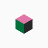
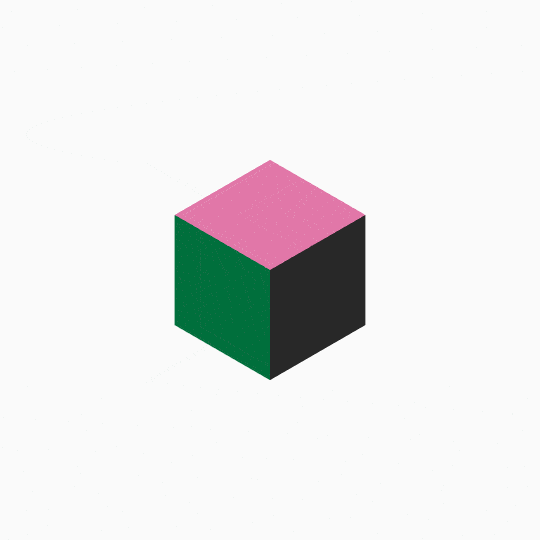

# ANGUAR PROJECTS

[Come to my Angular project - list](https://renjeka.github.io/Angular_Projects/  "My Angular site")

#### Hello!
Here is my all Angular projects, I make.

I appreciate your interest in my projects. Come and see everything. Here you are always welcome! 

Here are some projects you can see:

[My first app](#  "My first Angular app")
`first-app` — It's my first study project

This is a very simple application for understanding the basics of Angular and fixing key topics:
+ components, 
+ directives, 
+ patterns, 
+ routing